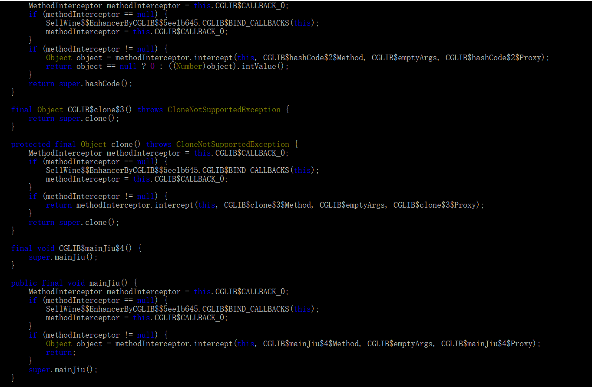

## 1.值传递与引用传递

首先可以明确的是java里面没有引用传递

```java
public class Test {
    public static class Employee {
        public int age;
    }

    public static void changeEmployee(Employee employee2) {
        employee2.age = 1000;
    }

    public static void main(String[] args) {
        Employee employee = new Employee();
        employee.age = 100;
        changeEmployee(employee);
        System.out.println(employee.age);
    }
}
```

以上代码输出1000,changeEmployee修改了employee对象的age;

其实不然,java代码在运行时会为每个线程分配独立的栈空间,并共享堆空间,每一个线程执行的方法都会被包装成一个栈帧入栈.每一个栈帧都会包含独立的临时变量表(LocalVariableTable),操作数栈,动态链接等等;

如上例,main函数栈帧的临时变量表里有一个employee变量,它的指针指向堆内存空间的Employee对象,假设地址为0x10101111.

而初始化changeEmployee对应栈帧时,该栈帧对应的临时变量表里会有一个employee2变量,该变量指针指向堆内存0x10101111这个地址;所以如果直接修改该变量指向的堆内存的数据,会导致main函数的employee变量发生变化;但这并不意味着是引用传递,仅仅是复制了指向堆内存地址.

如果changeEmployee方法改为如下,则employee2指向的堆内存地址发生变化,修改age,并不会导致employee也跟着变化

```java
public static void changeEmployee(Employee employee2) {
    	employee2= new Employee();
        employee2.age = 1000;
   }
```

## 2.java object类有哪些方法

(1)tostring输出方法名+"@"+无符号16进制的hashcode

(2)clone 浅拷贝

(3)notify,notifyall,wait必须要在synchronize代码块内部使用

(4)hashcode获取对象的hash值

(5)getClass获取字节码

(6)finalize 对象被回收前调用

## 3.深拷贝

(1)通过序列化反序列

(2)实现cloneable接口,自己拷贝所有属性

## 4.final,finally,finalize

(1)final修饰类,表示无法继承,修饰方法,表示无法被子类重写,修饰变量,表示一旦初始化,就无法被修改(如果是对象变量,表示无法修改指针指向的地址,可以修改堆内存中对象的属性)

(2)finally 一般跟在try代码块之后,表示一定执行的代码块(无论是否异常),字节码在编译的时候会在所有分支的最后都加上finally代码块

(3) finalize 这个方法是Object对象的protected修饰的方法，当虚拟机在进行回收一个对象之前的时候，会去调用该对象的finalize（）方法，这个方法只能是被动的被调用，就算是我们主动去调用该方法去回收一个对象，也不会起到作用的，因为他是有虚拟机自己去决定的。 

## 5.泛型

泛型是在编译期限制,做参数化类型限制的,可以对接口,方法,对象使用泛型.

一般在编译完后,泛型就会被擦除,无法通过字节码反射获取真正的类型,比如无法获取new ArrayList<String>里具体的泛型string类.

```java
class A<T, ID> {  
}  
  
class B extends A<String, Integer> {  
}  
  
public class Generic {  
  
    public static void main(String[] args) {  
        System.out.println(B.class.getGenericSuperclass());  
        ParameterizedType parameterizedType = (ParameterizedType) B.class.getGenericSuperclass();  
        Type[] actualTypeArguments = parameterizedType.getActualTypeArguments(); 
        for(Type actualTypeArgument: actualTypeArguments) {  
            System.out.println(actualTypeArgument);  
        } 
    }  
}
```

但是可以反射获取到以上代码这样的泛型具体类

## 6.java异常体系


(1)error java程序无法处理的异常,比如oom

(2)exception 

​	(2.1)检查时异常,需要try catch或者方法上加throws 

​	(2.2)运行时异常,不需要显示捕获

## 7. 访问修饰符

- public的访问权限：当前类，子类，当前类所在的包下，以及其他包下都可以进行访问。
- protected的访问权限：除了当前类所在的包下、以及子类都可以访问，其他的包下都不能进行访问。（可以用肥水不流外人田记忆，哈哈）
- 默认的话：只能当前类和当前类所在的包下可以访问，当前类的子类和其他包下都不能进行访问。
- private的访问权限：只有当前类可以访问（你可以理解成，加了private的话，这个人的钱就只能他自己知道他有多少钱，别人都不知道）

## 8.成员变量,局部变量初始化

(1)静态成员变量初始化实在类加载阶段(加载,验证,准备,解析,初始化)的准备阶段和初始化阶段进行.

​	准备阶段: 给基本类型赋0或false,给非基本类型赋null;

​	初始化阶段:按照以下顺序执行(非静态代码块和构造函数,是实例化时触发)

( 父类静态代码块>子类静态代码块>父类非静态代码块>父类构造函数>子类非静态代码 块>子类构造构造函数 )

注: 静态代码块和静态变量的赋值是看谁在上就先执行谁的

​	 先执行的代码块或赋值触发对象的实例化(比如 static A a = new A()),那就会先去执行A对象的实例化

​	 如果A的类没有被加载过,那就会先去加载A类,顺序如上

(2)局部变量初始化,如果单纯定义而没有使用,则无需初始化,编译时也会去掉该变量,但是如果被使用了,则必须要初始化

##  9.string,stringbuffer,stringbuilder

(1)string,stringbuilder线程非安全的

(2)string是字符串常量,而不是变量,一旦创建就无法修改,stringbuffer,stringbuilder是字符串变量,可以被修改

(3)string字符串拼接一般会被优化成常量,如果循环拼接还会变成stringbuilder;

## 10.string反射修改值和intern

```java
public static void main(String[] args) {
         String ss2 = new String("ABCD");
        String str = "ABCD";
        String ss = "ABCD";
        System.out.println("str = " + str);
        try {
            Field valueField = String.class.getDeclaredField("value");
            valueField.setAccessible(true);
            char[] valueCharArr = (char[]) valueField.get(str);
            valueCharArr[0] = 'G';
            System.out.println(str);
            System.out.println(ss);
            str.intern();
            ss.intern();
            System.out.println(ss);
            System.out.println(ss);
            System.out.println(ss2.intern() == ss);
            System.out.println(ss2 == ss);
        } catch (NoSuchFieldException | SecurityException
                | IllegalArgumentException | IllegalAccessException e) {
            e.printStackTrace();
        }
    }
```


string可以被修改,但是ss也被修改了;

原因:

- 字符串是被保存在常量池中的
- 字符串被保存在常量池中对应着一个唯一的字符串序列和一个String对象引用，而该对象被保存在堆内存中。所以这也是为什么直接给String变量赋值后,就能够像String对象那样使用。
- 其中的字符串序列和引用之间是一个键值表的形式。

intern()方法

- 如果当前字符串内容存在于字符串常量池（即equals()方法为true，也就是内容一样），那直接返回此字符串在常量池的引用；

- 如果当前字符串不在字符串常量池中，那么在常量池创建一个引用并指向堆中已存在的字符串，然后返回常量池中的引用。

简单说intern方法就是判断并将字符串是否存在于字符串常量池，如果不存在则创建，存在则返回。

## 11.接口和抽象类

(1) 相同之处

​	(1.1) 都不能直接实例化

​	(1.2)可以将两者作为形参,引用类型

​	(1.3)子类都需要实现两者的所有抽象方法,除非子类是抽象类或接口

(2)不同之处

​	(2.1)接口:

​		(2.1.1)接口只能有抽象方法,jdk1.8后允许有默认方法

​		(2.1.2)接口的成员变量都是常量,所以必须初始化

​		(2.1.3)接口的方法都是public,abstract,且不能是静态的

​		(2.1.4)接口不能有构造方法

​		(2.1.4)子类可以多实现接口,只能单继承抽象类,接口只能继承接口,不能继承抽象类

​	(2.2)抽象类

​		(2.2.1)抽象类可以有普通变量

​		(2.2.2)抽象类可以有普通方法和静态方法

​		(2.2.3)抽象类可以有构造方法

​		(2.2.4)抽象类的抽象方法可以是protected,default,不能是private,也不能加static

## 12.静态代理和动态代理

代理模式可以在不修改被代理对象的基础上，通过扩展代理类，进行一些功能的附加与增强。值得注意的是，代理类和被代理类应该共同实现一个接口，或者是共同继承某个类。

```java
public interface Movie {
  void play();
}
```

```java
public class RealMovie implements Movie {

    @Override
    public void play() {
        System.out.println("您正在观看电影 《肖申克的救赎》");
    }

}
```

```java
package com.frank.test;

public class Cinema implements Movie {

    RealMovie movie;

    public Cinema(RealMovie movie) {
        super();
        this.movie = movie;
    }

    @Override
    public void play() {
        guanggao(true);
        movie.play();
        guanggao(false);
    }

    public void guanggao(boolean isStart){
        if ( isStart ) {
            System.out.println("电影马上开始了，爆米花、可乐、口香糖9.8折，快来买啊！");
        } else {
            System.out.println("电影马上结束了，爆米花、可乐、口香糖9.8折，买回家吃吧！");
        }
    }

}
```

```java
 public static void main(String[] args) {
        RealMovie realmovie = new RealMovie();
        Movie proxy = new Cinema(realmovie);
        proxy.play();
    }
```

动态代理和静态代理的目的都是一样,都是对被代理对象做增强,只是不需要自定义代理对象(比如cinema),就可以生成代理对象;

```java
public interface SellWine {
     void mainJiu();
}
```


```java

public class MaotaiJiu implements SellWine {
    @Override
    public void mainJiu() {
        System.out.println("我卖得是茅台酒。");
    }
}
```

```java
public class GuitaiA implements InvocationHandler {

    private Object pingpai;


    public GuitaiA(Object pingpai) {
        this.pingpai = pingpai;
    }
    
    @Override
    public Object invoke(Object proxy, Method method, Object[] args)
            throws Throwable {
        System.out.println("销售开始  柜台是： "+this.getClass().getSimpleName());
        method.invoke(pingpai, args);
        System.out.println("销售结束");
        return null;
    }
}
```

```java
public static void main(String[] args) {
    MaotaiJiu maotaijiu = new MaotaiJiu();
    InvocationHandler jingxiao1 = new GuitaiA(maotaijiu);
    SellWine dynamicProxy = (SellWine) 	   	Proxy.newProxyInstance(MaotaiJiu.class.getClassLoader(),
                                                              MaotaiJiu.class.getInterfaces(), jingxiao1);
    dynamicProxy.mainJiu();
}
```

这里展示的jdk动态代理,默认生成的代理对象类$proxy0类继承了proxy类,实现了sellwine接口,对mainJiu方法调用了InvocationHandler的invoke方法


处理jdk动态代理外,常用的动态代理还有cglib代理

```java

public interface SellWine {
     void mainJiu();
}
```

```java
public class SellWineCglib implements MethodInterceptor {  
    private Object target;  
  
    /** 
     * 创建代理对象 
     *  
     * @param target 
     * @return 
     */  
    public Object getInstance(Object target) {  
        this.target = target;  
        Enhancer enhancer = new Enhancer();  
        enhancer.setSuperclass(this.target.getClass());  
        // 回调方法  
        enhancer.setCallback(this);  
        // 创建代理对象  
        return enhancer.create();  
    }  
  
    @Override  
    // 回调方法  
    public Object intercept(Object obj, Method method, Object[] args,  
            MethodProxy proxy) throws Throwable {  
        System.out.println("事物开始");  
        proxy.invokeSuper(obj, args);  
        System.out.println("事物结束");  
        return null;  
  
    }  
  
}  
```

同样生成的代理类实现了sellwine接口,并在mainjiu方法调用了MethodInterceptor方法



jdk动态代理只能对接口生成代理对象,cglib既可以是类也可以是接口

在spring中,aop的实现就是动态代理.如果是接口默认采用jdk动态代理,可以强制指定cglib,如果是类默认cglib


注:代理模式和装饰模式很像,都是被代理(被装饰)的类和代理类(被装饰的类)实现同一个接口(父类),然后以组合的方式是传入被代理(被装饰)的类

​	我理解代理模式和装饰器模式都是对被代理(被装饰)对象功能的增强

​	只是代理模式增强方法可以与被代理对象的方法无关,而且增强方法可以对一系列的被代理对象增强,比如增加日志的增强方法,可以对A类对象的A方法增强,也可以对B类对象的B方法增强;

​	装饰模式则是侧重于对被装饰对象方法相关的增强,而且装饰类可以有多个,可以层层嵌套,以实现多钟功能装饰,比如java io里的inputstream,FileInputStream原本只是具备读取文件的字节流,通过BufferedInputStream装饰后FileInputStream具备了缓冲的能力,通过PushbackInputStream装饰后FileInputStream具备了字节码退回读取字节的能力;

```java
PushbackInputStream pbi = new PushbackInputStream (new BufferedInputStream(new FileInputStream("/a")));
```

## 13. 什么是序列化和反序列化？序列化的底层怎么实现的？

Java序列化是指把Java对象保存为二进制字节码的过程，Java反序列化是指把二进制码重新转换成Java对象的过程.常用的fastjson也是把对象转成字符数组(同样也是二进制流);

```java
public static void main(String args[]) throws IOException {  
 
       FileOutputStream fos = new FileOutputStream("D:/demo.text");  
       ObjectOutputStream oos = new ObjectOutputStream(fos);  
 	//这个是一个需要序列化的实体对象
       User user = new User（）；  
 	//这是为了把实体对象写到输出流中，然后保存到D盘的一个路径下
       oos.writeObject(user);  
       oos.flush();  
       oos.close();  
 
} 
```


不是字符串,不是数组,不是枚举,必须要实现serializable接口,否则无法序列化

## 14 switch

(1)支持字符串

```java
	switch (a){
            case "3C":
                System.out.println("A");
                break;
            case "2b":
                System.out.println("B");
                break;
            case "C":
                System.out.println("c");
                break;
        }
```

编译后的字节码指令


这里取的是字符串的hashcode比较,然后相同的用equals比较具体的值;

等同于

```java
switch (a.hashcode()){
            case "3C".hashcode():
                if("3C".equals(a)){
                    System.out.println("A");
                    break;
                }
            case "2b".hashcode():
                if("2b".equals(a)){
                    System.out.println("B");
                    break;
                }
            case "C".hashcode():
        		if("C".equals(a)){
                    System.out.println("c");
                	break;
                }
                
        }
```

当然这里3c和2b的hashcode一样,分支应该会合并

```java
switch (a.hashcode()){
            case "3C".hashcode():
                if("3C".equals(a)){
                    System.out.println("A");
                    break;
                }
                if("2b".equals(a)){
                    System.out.println("B");
                    break;
                }
                
            case "C".hashcode():
        		if("C".equals(a)){
                    System.out.println("c");
                	break;
                }
                
        }
```


(2)支持枚举类是因为每个枚举类的对象都有一个唯一序号(ordinal)

```java
switch (Code.SUCCESS) {
    case SUCCESS:
        //......
        System.out.println("sucess");
        break;
    case FAIL:
        //......
        System.out.println("fail");
        break;
}
```


## 15 基本类型

(1)byte 一个字节(8位),范围-128到127(2^7-1 ~ -2^7 最高为是符号位)

(2)char (utf-8 数字和英文字符占一个字节,其它字母占两个字节,汉字有的是三个,有的是四个)

(3)short 两个字节(16位),范围-32768 ~ 32767(2^15-1 ~ -2^15)

(4)int 四个字节(32位),范围20多亿(2^31-1 ~ -2^31)

(5)Long 8个字节(64位) ,范围2^63 -1 ~ 2^63

(6)float 单精度4个字节(1位符号位,8位指数位,23为尾数位)  2^128 ~ -2^128约(3.4E38 ~-3.4E38)

​	double 双精度 8个字节(1位符号位,11位指数位,23位尾数位)   2^1024 ~ -2^1024

## 16 重载和重写

- 首先重载是发生在同一个类中的，他的参数个数、参数顺序、参数类型都可以不同，但是重载的方法名必须相同

- 重写的话，一般发生在父子类中，方法名、参数类型、参数列表都必须相同。典型的例子就是定义一个接口，我们去实现一个接口其实就是一种典型的重写。

- 重写的返回类型可以是父类方法返回类型的子类,这时会生成一个桥接方法.使用泛型时也会生成桥接方法;

  ```java
  public interface SuperClass<T> {
  
      T method(T param);
  
  }
  
  public class SubClass implements SuperClass<String> {
      public String method(String param) {
          return param;
      }
  }
  
  public static void main(String[] args) throws Exception {
          SuperClass superClass = new SubClass();
          System.out.println(superClass.method("abc123"));// 调用的是实际的方法
          System.out.println(superClass.method(new Object()));// 调用的是桥接方法,会强转参数,但是编译不会报错
      }
  ```

  


## 17 integer

```java
public static void main(String[] args) {
    Integer s1 = new Integer(128);
    Integer s2 = new Integer(128);

    Integer s3 = new Integer(127);
    Integer s4 = new Integer(127);
    Integer s5 = 127;
    int s6 = 127;
    int s7 = 128;
    Integer s8 = 128;
    Integer s9 = 128;
    Integer s10 = 127;
    //第一种情况：Integer类型的和new Integer（）类型的进行比较永远都是false
    System.out.println(s5 == s4);//false
    //第二种情况：如果一个是Integer类型的，一个是int类型的只要是这两个类型进行比较，只要是数值相等就肯定相等
    System.out.println(s5 == s6); //true
    System.out.println(s7 == s8);
    //第三种情况：只要是两个Integer对象都是new出来的Integer对象，比较一律俺对象进行处理
    System.out.println(s3 == s4); //false
    System.out.println(s1 == s2); //false
    System.out.println(s3.equals(s4)); //true
    System.out.println(s1.equals(s2));//true
    //第四种情况：也就是最关键的，如果两个都是Inter类型的进行比较的话，那么会先把【-128,127】的都当成一个int常量进行比较
    //            如果两个Integer类型的数超过这个范围，其实就相当于是还需要按照对象进行比较
    System.out.println(s8 == s9);//false
    System.out.println(s5 == s10);//true
    
    //int会总动向上转型变成long
   System.out.println(127 == 127L ); //true
    System.out.println(128 == 128L); //true
    //只要有一个是基本类型,另一个就会拆箱至基本类型,然后需要向上转型就向上转型
    System.out.println(Integer.valueOf(128) == 128L);//true
    System.out.println(new Integer(128) == 128L);//true
    System.out.println(128 == new Long(128L));//true
	//报错两个不同包装类不会拆箱
    System.out.println(new Integer(128) == new Long(128L));
}

```

- Boolean：(全部缓存)
- Byte：(全部缓存)
- Character(0 ~ 127缓存)
- Short(-128 — 127缓存)
- Long(-128 — 127缓存)
- Integer(-128 — 127缓存) 只有它可以修改缓存范围
- Float(没有缓存)
- Doulbe(没有缓存)