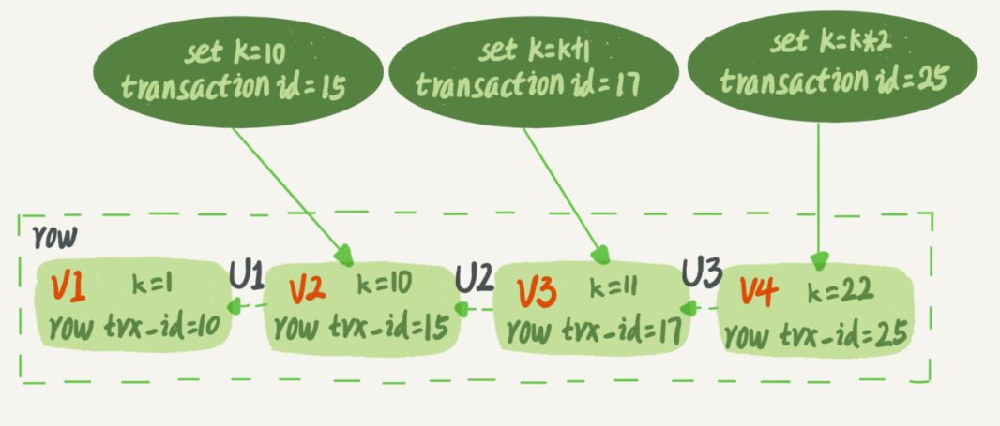

## 1.查询流程

server层 : (1) 客户端发送请求

​				  (2)mysql 连接器建立连接,读取数据,权限验证(用户名密码,此时读到权限是这个连接范围内的,就算修改了权限,该连接也不会生效,默认失效时间8小时),

​                  (3)如果开启了查询缓存,那么命中就直接返回,这是key-value形式,key是sql完整的语句(包括注释),只要语句不一样(等效的语句也没用),就会多一个缓存;而且针对相应表的任何增删改操作,都会使缓存失效,这缓存不想redis等集中式缓存,是单实例的,主从并不一致.一般不建议开启

​                  (4)词法分析器(分析词义语法分析) ,找出select,update等关键词,找出表名,id等列名

​                  (5)优化器(生成执行计划,索引选择),决定表的连接顺序,索引顺序

​                  (6)执行器(调用引擎层api,查询数据),判断是否表的权限,判断表的引擎类型,调用相应的引擎获取数据

引擎层:

​			bufferpool中的数据页如果有该数据则返回,否则,会读取磁盘数据放入bufferpool的LRU List

## 2.更新流程

server层与查询流程一致

引擎层

​	(1)获取对应行数据返回给server层

​	(2)收到更新新行的数据

​	(3)找到buffer pool对应的数据页更新(数据页变脏了),脏页不仅存在于LRU LIst,也存在于FLUSH List(该链表主要用于刷脏)

​	(4)如果涉及到索引更新插入删除等操作,还会更新索引页,如果索引不在buffer pool中,会把改变索引操作写入insert buffer(新版本变为changebuffer)

​		增删改一般还会涉及到undolog的变化,会把改变的操作计入undologbuffer中

​	(5)将数据页和索引页以及undo页的变化写入redolog buffer(默认8M)

​	这是redolog prepare阶段

​	至于redolog何时持久化

​	为了控制 redo log 的写入策略，InnoDB 提供了 innodb_flush_log_at_trx_commit 参数，它有三种可能取值：设置为 0 的时候，表示每次事务提交时都只是把 redo log 留在 redo log buffer 中 ;设置为 1 的时候，表示每次事务提交时都将 redo log 直接持久化到磁盘；设置为 2 的时候，表示每次事务提交时都只是把 redo log 写到 page cache。如果设置为1,prepare阶段也会持久化,以应对崩溃恢复

​	(6)server层拿到引擎层响应,会将更新操作(逻辑语句)写入binlogCache(每个线程都会维护一个,保证每个事务的binlog不会其他事务的binlog混起来)

​	binlog何时持久化

​	sync_binlog=0 的时候，表示每次提交事务都只 write，不 fsync；sync_binlog=1 的时候，表示每次提交事务都会执行 fsync；sync_binlog=N(N>1) 的时候，表示每次提交事务都 write，但累积 N 个事务后才 fsync。

​	(7)提交事务(binlog提交,然后调用引擎层的api让redolog也会提交)

## 3.双1设置下的崩溃恢复(引用2的流程)

- 更新流程在(5)到(6)之间断电,因为binlog未提交,没有数据,redolog哪怕prepare持久化了也会回滚.备库也不会受到该事务的binlog

- 如果在(6)到(7)

  情况1: 如果redolog有commit标志,表示事务完成已提交,那就直接提交

  情况2: 如果redolog不完整,只有prepare日志,那就看binlog是否完整

  ​					如果完整,就提交事务,判断是否binlog完整,在statement格式会有commit,rows格式下		XID event;

  ​					如果不完整,就会滚事务

- 崩溃恢复时,会顺序扫描redolog,然后根据redolog是否完整,然后拿着redolog的xid去binlog找事务事务完整

- 只要redolog已经prepare且binlog完整就能恢复数据,这么设计是因为备库可能同步了binlog,为了保证主备数据一致,这么设计

## 4. 事务的隔离(因为mysql的事务是由引擎层实现这里只讨论支持事务的innodb)

当多事务并发执行会出现脏读,不可重复读,幻读

- 脏读:读到其他事务未提交的事务

- 不可重复读: 同一事务读两次,读到内容不一样的数据

- 幻读: 同一事务读两次,发现多处一行数据

隔离级别

- 读未提交(Read Uncommited),三个问题都无法解决
- 读已经提交(Read Commited),能解决脏读
- 可重读读(repeatable read),能解决脏读,不可重复读
- 串行读(Serializable)能解决脏读,不可重复,幻读

​	RR级别下,基于快照读的数据是一致,如果是当前读,是会读到其他事务提交的数据

​	RR级别下,采用next-key lock,gap lock可以避免当前读下的幻读,但是无法完全避免幻读

隔离级别的实现(多版本并发控制: mvcc):

​	主要是基于一致性视图和undolog实现的;

​	每个事务都有一个事务id,按照申请顺序严格递增,每行数据也都是有多个版本的。每次事务更新数据的时候，都会生成一个新的数据版本，并且把 transaction id 赋值给这个数据版本的事务 ID，记为 row_trx_id。同时，旧的数据版本要保留,就把就数据放入undolog中.然后指针指向旧数据.如果多个版本的数据,就像是链表一样链在一起;

​		一致性视图(consistent read view): 

​		事务启动时记录下当前时刻活跃的事务,组成一个事务数组.这个事务数组加上自身事务组成了一致性视图;

​		因为事务单调递增,所以可以划分出高水位低水位以及三个区间.根据这三个区间以及当前查询事务的id,就可以确定事务版本;

​		如上图是事务A执行查询操作时的某一数据行的版本以及事务id,假设启动时事务A记录的活跃事务ID数组为(11,15,16,22,25,26).当前事务A的事务id为26.

​		于是对于事务A而言,如果数据版本的事务id大于26,因为在事务A之后创建的事务,自然对事务A不可见,如果小于11表示,该版本的数据已提交,且在事务A创立前就已提交,自然可见.如果在11到26之间,就要看是否在活跃事务数组内,如果在则表示该数据版本的事务未提交,不可见,如果不在,则可见;

​		如上举的例子,事务A去查询该行数据,因为v4版本的事务id是25,小于26且大于11,落在11到26之间,判定是否在数组内,在数组内,不可见,只能顺着指针往前找数据.此时V3版本的事务id是17,在11到26之间,但不在事务数组内,可见,于是拿到V3版本 的数据k=11;

​		基于一致性视图的不同创建时机,出现了不同的隔离级别.

​		RU是不会创建一致性视图,所有数据直接读的当前行的数据(当前读,与加锁的select语句效果一样),故而可以读到其他事务修改的数据

​		RC每次查询都会查询都会创建一致性视图,故而不会其他事务未提交的数据,但是可以读到其他事务已提交的事务;

​		RR隔离级别,只有在第一次查询时才会创建一致性视图,之后就都不会了,所以不会读到在它之后提交的事务数据.

​		Serializable隔离级别,对每行数据加锁,串行化执行.

## 5.索引概念

​		innodb的索引结构是B+树

(1)hash表创建索引(数组+链表),增加,更新,删除,查询的时间复杂度可以为O(1),但是值符合等值查询的场景,范围查询时就不适用了

(2)二叉树:更新,删除复杂度O(logn),如果是平衡二叉树(红黑树),查询复杂度也能是O(logn),但是innodb索引不仅存在于内存,还存在于磁盘,二叉树的树高过高,导致查询磁盘的次数过多,而随机读写磁盘的性能远远小于随机读写内存的(内存估计几十纳秒,ssd硬盘估计几十微秒,机械硬盘估计几十毫秒);

(3)B树:多路查找树,一个节点可以有多个子节点,增删改查的复杂度也能是O(logn),但是因为B树的非叶子节点也会存储数据(比如主键索引的id),导致一个节点的子节点数量有限,从而在数据总量一定的情况下,树高较大;

(4)B+树:B树的进阶,非叶子节点不存储数据,所有数据在叶子节点上,非叶子节点只存储索引的值以及指向子节点的指针;

在innodb索引中,索引(数据行是主键索引的叶子节点)是一颗B+树,其节点是就是页,每一层页,都是排序好的双向链表,如上图,但是页内部的索引值(或者行记录)却并非是有序的双向链表,而是单向链表.

innodb是以页为单位整体读取数据的,内存中查找数据相对磁盘而言迅速的多,为了尽快查到数据,页内部还会对行记录抽取一些数据,构成一个有序的数组,被称为slots,然后二分查找加快链表查询速度;

主键索引(clustered index): innodb的表数据默认是以主键索引组织数据的,主键索引的非叶子的页存储的是主键的值,叶子节点存储的是真实数据;如果没有设置主键,innodb会默认生成一个6位的主键;也被叫做聚簇索引;

非主键索引(secondary index): 叶子页内的行记录会存储主键,非叶子节点只会存储索引列的值;也被叫做二级索引,非聚簇索引;

回表: 如果查询使用了非主键索引,会找到行记录对应主键,然后从主键索引上查到真正的数据返回,这个过程被称为回表.

覆盖索引: 如果非主键索引,包含了查询的列数据,可以不需回表直接返回,这时被称为覆盖索引;

​				有时候模糊匹配,因为非主键索引包含了查询锁需要的字段,而非主键索引全表查的代价小,也会选择该二级				索引

​				explain时会看到extra字段会有use index;

联合索引:多个列组成的索引;页里面的行记录会有这两个列的数据,并且按照定义的顺序排好;

索引下推: 有些判断条件在二级索引上可以直接判断,无需回表去查数据,被称为索引下推.比如有一个a,b两个字段的联合二级索引,条件是a=1 and b<10,那么老版本的innodb查到a=1的主键后会回表去取数据再做b的判断,新版本的innodb直接在联合二级索引上就可以判断了;

​				explain时会看到extra字段会有use index condition;

最左匹配原则: 联合索引有多个字段,以a,b,c三列定义,故而索引页内的行记录会按照a,b,c的顺序排列,查找条件a=1或a =1 and b=1或a =1 and b=1 and c = 1都可以走该索引,但是b=1或b=1 and c=1都不会该索引;

## 6 索引的增删改查

还是以5的图为例,

(1) 查询

- 如果查询50,那么第一层树发现存在这个值,那就直接拿到第二层的页指针,然后去第二层相应的页,然后在页内部精确查找数据,如果第二层非叶子节点,还会继续往下知道拿到数据或主键索引的主键(二级索引,拿到主键,还要回表走一样的过程);

- 比如说60,第一层发现没有,那它就会找到相邻的两条记录,50,75,然后拿到第二层所在的两个页指针,从50所在的页顺着链表往75所在页,查找相应的值,找到则可以拿到相应的子页指针,继续向下;

- 如果找一个不存在的值,那就是会找每一层相邻的记录,然后再往下一层的页遍历找相邻的记录.

(2) 插入

- 如果插入31,那么找到第二层的第二页,插入就行了;

- 如果76,第二层第四页数据已满,但是第一层数据未满,此时就会发生页分裂,第一层会多一条数据,而第二层会多一条页.

- 如果第一层和第二层数据都满了,那两层的页都会发生分裂.

  

  (3)删除

​		innodb在删的时候仅是在行记录标记了一下删除,并没有真正删除磁盘.目的是尽量复用页及其数据,避免大量页分裂和页合并.但也因此带来磁盘和内存的部分开销;

## 7.优化器不选择二级索引

(1)当范围查询查到的数据大于表数据的20%,优化器会认为走索引回表的代价较大,于是就选择了主键索引

(2)当一个索引的离散程度(区分度)较大时,比如性别这个字段只有男女两种,你查询男生的信息,也会导致放弃二级索引

(3)优化器选择索引的标准,一般是根据扫描行数(读磁盘的代价)+回表的代价,是否需要排序(索引一般是排好序的,否则就要额外排序),是否使用临时表;

​	扫描行数如何判断?不可能扫表,那样代价太大,只能通过"区分度"估计.innodb上有一个基数(cardinality),show index可以看到,

​	表示这张表有几个不一样的值,这个值是估算出来的;

​	innodb会统计N个页不同的值,获取平均值,然后乘以这个索引的总页数,当超过1/M的数据发生变化时,innodb会重新统计cardinality;

   在 innodb中，有两种存储索引统计的方式，可以通过设置参数 innodb_stats_persistent 的值来选择：设置为 on 的时候，表示统计信息会持久化存储。这时，默认的 N 是 20，M 是 10。设置为 off 的时候，表示统计信息只存储在内存中。这时，默认的 N 是 8，M 是 16。 

​	这里采样容易不准确,不准确可能导致索引错误选择,可以用analyze table重建索引来更新基数

	## 8 有时候sql为什么会慢

(1) redolog写满了,此时会停下来刷脏,空出一部分redolog,会影响更新;

(2)buffer pool没有查询的数据,需要去磁盘读取,然后存入buffer pool中,如果buffer pool已满,会淘汰一些不常用的数据页,如果淘汰的是脏页,还会刷脏,影响查询性能;所以尽量避免大数据查询,会导致大量LRU页被淘汰,热数据被淘汰还会影响其他查询;

(3)等待表级锁,比如MDL写锁

(4)等待行级锁

(5)本身就慢,比如不走索引

## 9 count(*)

(1)mysiam 会记录行数,持久化到磁盘上,但是如果带条件还是得扫全表

(2)innodb 的count(*)是扫全表,至于为什么和mysiam一样,是因为innodb支持事务,它的行数每个事务都不一样,无法提前统计;

​	innodb的count(*)做了优化,会选择最小的索引进行全表扫描,当然如果带条件,还是看优化器选择索引;

​	count(字段)<count(主键 id)<count(1)≈count(*)

​	 count(*)、count(主键 id) 和 count(1) 都表示返回满足条件的结果集的总行数；而 count(字段），则表示返回满足条件的数据行里面，参数“字段”不为 NULL 的总个数。 语义不一样;

​	 对于 count(主键 id) 来说，InnoDB 引擎会遍历整张表，把每一行的 id 值都取出来，返回给 server 层。server 层拿到 id 后，判断是不可能为空的，就按行累加。对

​	于 count(1) 来说，InnoDB 引擎遍历整张表，但不取值。server 层对于返回的每一行，放一个数字“1”进去，判断是不可能为空的，按行累加。 

 	count(*)也不取值,累计加1,而且会在不影响逻辑的情况下选择最小的索引

## 10 锁

(1)从锁粒度划分

- 全局锁  Flush tables with read lock (FTWRL) ,一般是用于整库备份,会锁住整个库,所有ddl,dml的事务增删改都无法提交

- 表锁:     

  - 元数据锁  lock tables … read/write 限制表的写操作

  -  MDL（metadata lock)。MDL 不需要显式使用，在访问一个表的时候会被自动加上。MDL 的作用是，保证读写的正确性。你可以想象一下，如果一个查询正在遍历一个表中的数据，而执行期间另一个线程对这个表结构做变更，删了一列，那么查询线程拿到的结果跟表结构对不上，肯定是不行的。 

- 行锁 

  - 共享锁 lock in share mode

  - 排他锁 for update

  innodb有三种行锁算法
  
  - record lock,给单个行记录上锁
  
  - gaplock 给间隙锁,锁一个范围,不包括记录本身
  
  - next-key lock可以理解为record lock + gap lock 左开右闭

(2)  行锁的加锁规则

- 原则1:锁都是加在索引上,共享锁只会在当前选择的索引上加锁,如果不是主键索引,就不会锁主键索引.for update不仅会锁主键索引,也会锁主键索引;
- 原则2:默任情况下索引加的是next-key lock,只有扫描到的行才会加锁
- 优化1:唯一索引等值查询时,next key lock会退化成行锁
- 优化2:索引等值查找时,向右遍历知道不满足条件的第一个行为止,然后next-key lock会化为gap lock
-  一个 bug：唯一索引上的范围查询会访问到不满足条件的第一个值为止。 (查资料得知，mysql 8.0.18 开始，修复了这个 bug)

​    

​    

​    

​    