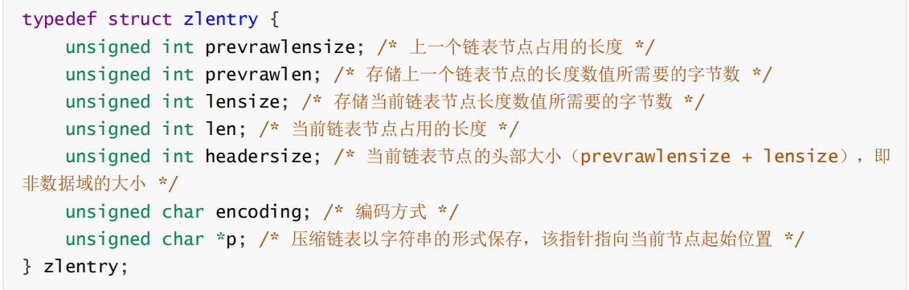
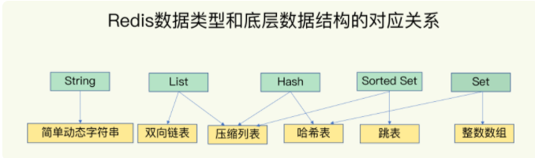
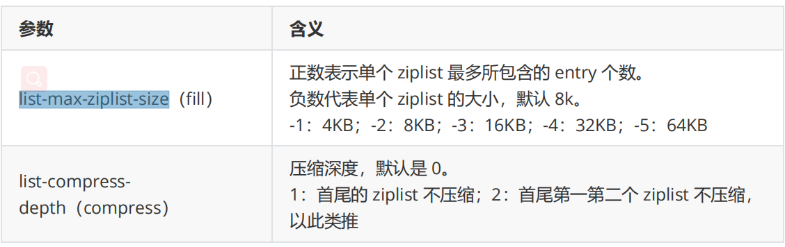
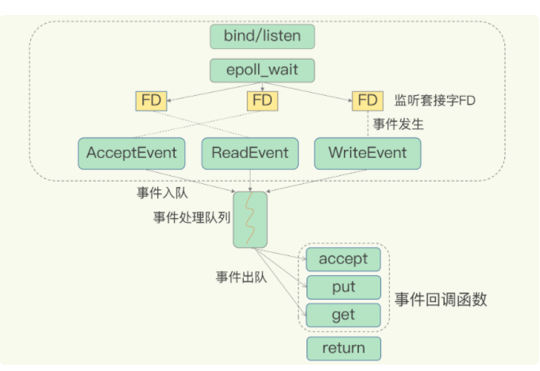

##  1 数据结构

- 全局hash表(数组+链表),和java的hashmap类似

  ```c++
  typedef struct dictEntry {
      void *key; /* key 关键字定义 */ 
      union { 
          void *val; uint64_t u64; /* value 定义 */ 
          int64_t s64;double d; 
      }v;
      struct dictEntry *next; /* 指向下一个键值对节点 */ } dictEntry;
  ```

  

  rehash,是扩容为原来的两倍,只是不像hashmap那样一次性复制完毕,而是采用渐进式rehash

  每一次处理请求时,将相应桶位的原数据迁移到新数组的的原数据

  

- 字典的key使用的是简单动态字符串SDS

  value是存在redisObject中

  

  - 字符串类型的编码格式

    如果是数字类型,int 存储8个字节的长整型,大于8个字节,会使用emstr或raw
  
    embstr,可以存储小于44字节的字符串,会使用sdshdr8,该格式内存连续,申请和释放只要一次;只能只读,一旦修改就会转成raw
    
    raw,可以存大于44字节的字符串,该格式申请和释放都需要两次
  
- zipList 

  压缩列表类似一个数组,数组每一个元素存放一个数据,列表头部有zlbytes(列表大小),zltail(列表尾部偏移量),zllen(列表entry的总个数),body是zlEntry集合,尾部有个zlEnd作为结束

  

  插入和删除的复杂度O(n),查询头结点和尾节点O(1),长度也是O(1)

  zipList的优势相对于数组的优势是,数组元素大小是固定的,用不上也会被占用,而且元素大小受最大元素

  相对于链表的优势,连续内存可以有效利用缓存行的优势

- skipList

  有序链表+索引

  有序链表查找的复杂度为O(n),索引可以理解为每隔一个或多个数据加上指针,构成新一层链表,这样查找数据可以从新链表开始,前进回退,这样查找复杂度可以降为O(n)

- 双向链表
  
- 整数数组
  
  

## 2数据类型

- list 

  

  满足list-max-ziplist-size,使用压缩列表,否则使用双向链表

  使用场景:

  ​	因为是有序的,可以用作队列(先进先出),栈(先进后出)

- Set

  set-max-intset-entries默认512,如果小于512个元素,使用整数数组,如果大于,则使用hash表

  使用场景:

  ​	随机抽奖:

  ​	标签;

  ​	点赞,点赞数

  ​	取交集

- Zset

  zset-max-ziplist-entries 128
  zset-max-ziplist-value 64
  
  小于这两个配置是使用zipList
  
  大于时使用skipList
  
  使用场景
  
  ​	新闻点击数+1,获取排行前几的新闻数
  
- Hash

  hash-max-ziplist-entries 512
  hash-max-ziplist-value 64

  小于这个配置时使用zipList

  大于时使用hash表

  使用场景: 

  ​	购物车:用户id,商品id,商品数量
  
- bitmap 
  
  底层是一个字符串
  
  可以用统计当月的登录次数
  
  布隆过滤器
  
  

## 3.使用场景

(1)聚合统计(取差集,交集,并集)可以使用set ,SUNIONSTORE,SINTERSTORE

​	统计前一天登录用户和今天登录用户的差值,算留存数据

​	可以用set app:昨天 数据

(2)排序统计(List,和zset都可以)

   在面对需要展示最新列表、排行榜等场景时，如果数据更新频繁或者需要分页显示，建议你优先考虑使用 Sorted Set。 

(3) 二值状态统计

   可以bitmap

   比如统计zuoqi,2008年8月登录次数,可以每天setBit user:zuoqi:200808  01 1,然后bitcount

(4)基数统计

​	不要求精确 HyperLogLog ,比如网站的uv

## 4.io模型



基于io多路复用,epoll回调,然后事件处理队列入队

## 5.线程阻塞点

- 和客户端交互

  网络io采用多路复用,一般不会阻塞,只有键值对的增删改查,才会阻塞主线程;而只有O(n)复杂度的操作,比如全量查询,集合的求交集,并集,差集

  bigkey的删除,因为释放内存,操作系统会把释放掉的内存插入一个空闲内存块的链表,内存越大,操作越慢

  清空数据库

- 和磁盘交互时的阻塞点

  aof同步写回策略,一般会延迟1到2ms

- 主从交互时的阻塞

  从库会清空数据库,加载RDB文件,RDB越大越慢
  
- clutser模式
  bigKey的迁移会阻塞主线程
  
##  6数据备份

- aof 

  - 类似mysql的binlog,记录操作的命令

  - 有三种写策略

    always 同步写回

    everysec 写入aof日志缓冲区,每秒刷盘

    no 就写入缓冲区,由操作系统决定刷盘实际

  - aof文件过大,提供了aof重写命令

- RDB

  bgSave命令可以后台子线程快照
  
  写时复制,在RDB快照生成时,主线程接收到修改命令会创建一个副本,最终子线程会把副本数据合并到RDB文件中
  
- 主从同步数据
  
  - 从库发送slaveof建立和主库连接
  
  - 从库发送psync命令(带上自身id和复制进度,默认为-1)
  
  - 主库会响应一个fullresync命令(带上主库的runid和复制进度)
  
  - 主库会生成一个RDB快照
  
  - RDB快照传输,主库会replication buffer记录传输过程中的命令
  
  - 命令传输
## 7 哨兵模式

  功能(1)判断主库下线

​		  (2)选出主库(依据从库的优先级,数据完整性,实例的runid)

​		  (3)通知客户端主库发生变化

​		  (4)通过相互之间的选票,选出执行主库变更的执行者

	## 8cluster模式

1.主库下线,主从切换

2.客户端重定向,计算hash slot,查找迁移hashslot

3.一致性hash算法


