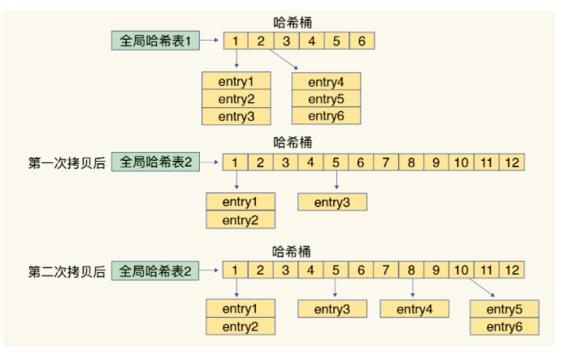
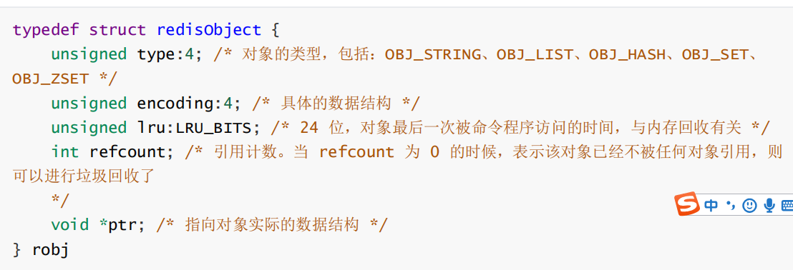

##  1 数据结构

- 全局hash表(数组+链表),和java的hashmap类似

  ```c++
  typedef struct dictEntry {
      void *key; /* key 关键字定义 */ 
      union { 
          void *val; uint64_t u64; /* value 定义 */ 
          int64_t s64;double d; 
      }v;
      struct dictEntry *next; /* 指向下一个键值对节点 */ } dictEntry;
  ```

  

  rehash,是扩容为原来的两倍,只是不像hashmap那样一次性复制完毕,而是采用渐进式rehash

  每一次处理请求时,将相应桶位的原数据迁移到新数组的的原数据

  

- 字典的key使用的是简单动态字符串SDS

  value是存在redisObject中

  

  - 字符串类型的编码格式

    如果是数字类型,int 存储8个字节的长整型

  